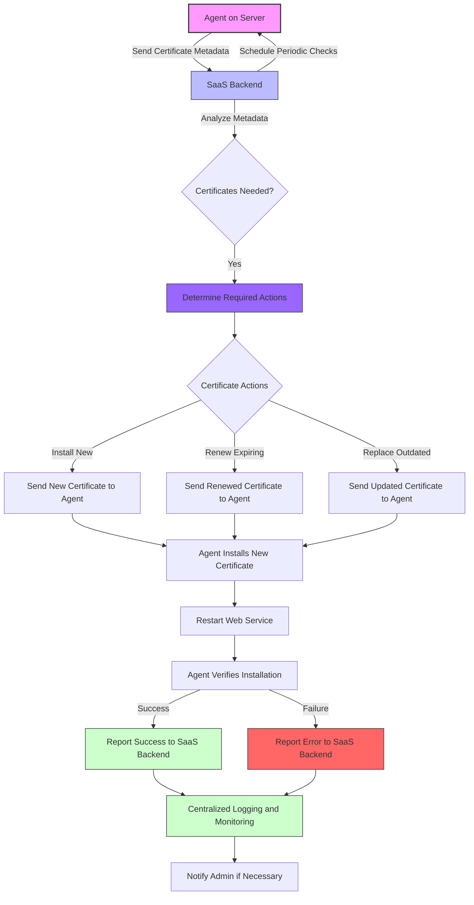

## Certificate Management Agent Workflow

## Agent-Driven Certificate Auto-Renewal and Installation Workflow

```mermaid
graph TD
    A[Agent on Server] -->|Send Certificate Metadata| B[SaaS Backend]
    B -->|Analyze Metadata| C{Certificates Needed?}
    C -->|Yes| D[Determine Required Actions]

    D --> E{Certificate Actions}
    E -->|Install New| F[Send New Certificate to Agent]
    E -->|Renew Expiring| G[Send Renewed Certificate to Agent]
    E -->|Replace Outdated| H[Send Updated Certificate to Agent]

    F --> I[Agent Installs New Certificate]
    G --> I
    H --> I

    I --> J[Restart Web Service]
    J --> K[Agent Verifies Installation]

    K -->|Success| L[Report Success to SaaS Backend]
    K -->|Failure| M[Report Error to SaaS Backend]

    L --> N[Centralized Logging and Monitoring]
    M --> N

    B -->|Schedule Periodic Checks| A
    N --> O[Notify Admin if Necessary]

    style A fill:#f9f,stroke:#333,stroke-width:2px;
    style B fill:#bbf,stroke:#333,stroke-width:1px;
    style D fill:#96f,stroke:#333,stroke-width:1px;
    style L fill:#cfc,stroke:#333,stroke-width:1px;
    style N fill:#cfc,stroke:#333,stroke-width:1px;
    style M fill:#f66,stroke:#333,stroke-width:1px;
```
