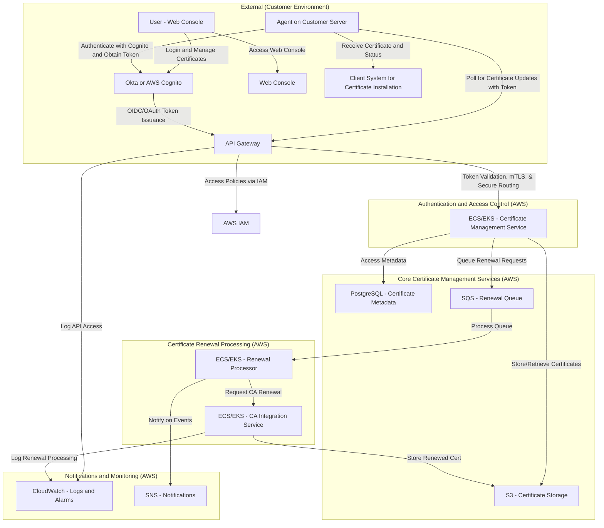

# System Architecture for Certificate Management Solution with SSO Integration

This architecture is designed for a scalable and secure certificate management solution on AWS, supporting **auto-renewal**, **SSO integration via OIDC**, and **certificate storage and delivery** to agents.

---

## 1. Architecture Overview

The architecture is divided into three main components:

- **Authentication and Access Control**: Manages user authentication with SSO integration and token-based access control.
- **Core Certificate Management Services**: Handles certificate lifecycle management, renewal, and compliance verification.
- **Data Storage and Notification Services**: Manages certificate storage, metadata, and notifications for administrators.

---

# Complete Architecture Diagram for Certificate Management System with Agent Authentication Outside

**Route Separation** : Within API Gateway, we will define separate routes (e.g., `/agent/*` and `/console/*`) for the Agent and Web Console APIs This separation allows you to apply different access controls, monitoring configurations depending on the actor making the request. We will also apply `mTLS` agent related apis
